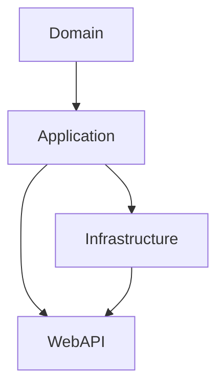
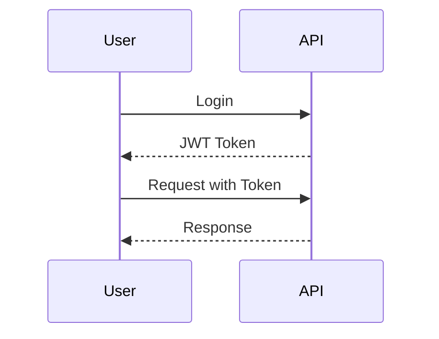
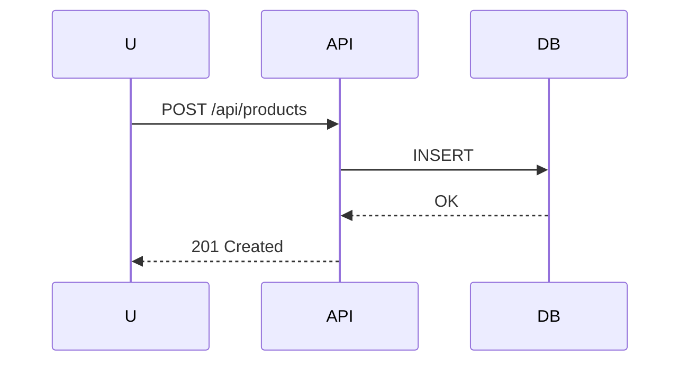

# 🏗️ Clean Architecture Solution (.NET 8 + PostgreSQL + Identity + JWT)

Includes Clean Architecture, CQRS, EF Core, PostgreSQL, JWT and Swagger.

## 📂 Structure
- Domain
- Application
- Infrastructure
- WebAPI

## 🚀 Run
```bash
dotnet restore
dotnet ef migrations add InitialCreate --project src/Infrastructure --startup-project src/WebAPI
dotnet ef database update --project src/Infrastructure --startup-project src/WebAPI
dotnet run --project src/WebAPI
```

## 🖼️ Diagrams

### Architecture


### JWT Auth


### CRUD

